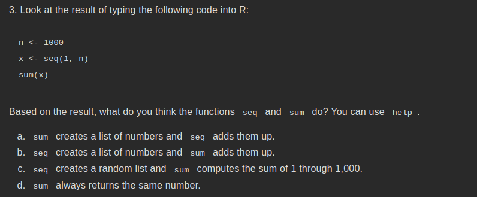
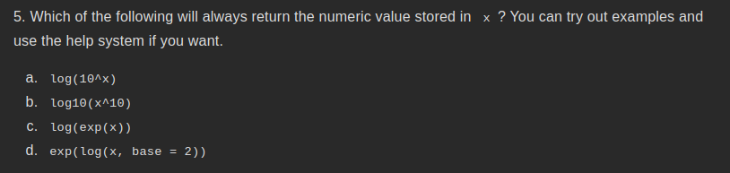
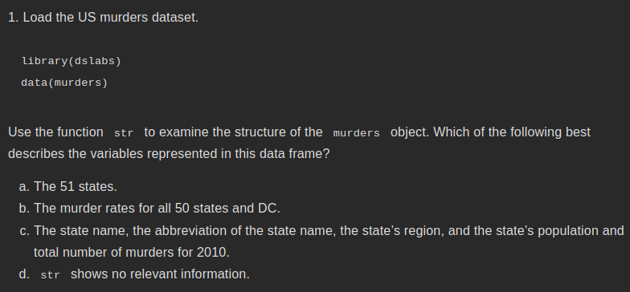
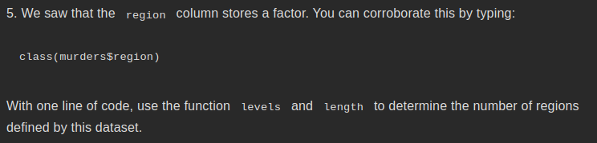

3) 

Answer: Option (B)
'seq' makes a list of numbers, in this case from 1 to 1000
'sum' just returns the sum of all items, in this case 'sum(x)' triggers sum of all items in x, and hence output : 500500

5)

Answer: Option (C)
this is because log(exp(5)) will return the value 5 and satisfies the requirement.

2.5 
1) 

Answer:
a) 
'data.frame':	51 obs. of  5 variables:
 $ state     : chr  "Alabama" "Alaska" "Arizona" "Arkansas" ...
 $ abb       : chr  "AL" "AK" "AZ" "AR" ...
 $ region    : Factor w/ 4 levels "Northeast","South",..: 2 4 4 2 4 4 1 2 2 2 ...
 $ population: num  4779736 710231 6392017 2915918 37253956 ...
 $ total     : num  135 19 232 93 1257 ...  

5)

Answer:
> levels(murders$region)
[1] "Northeast"     "South"         "North Central" "West" 

